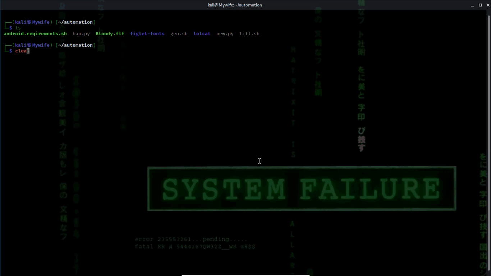

# preview
To run    ```python3 htb-invite.py```



If any Errors use this command

```apt install figlet && apt install curl && apt install python && pip install termcolor && apt install ruby && git clone https://github.com/busyloop/lolcat && cd lolcat/bin && gem install lolcat```

# In Termux

If you're using this tool on Android you need to install some tools before running this

coz you may get error!

So follow my steps

Just type 
```bash android.requirements.sh``` 
 
 or you can also run the above command that I've provided after the preview file
 
then all requirements will be satisfied... If you get any error put that in issues page let me solve it ASAP

